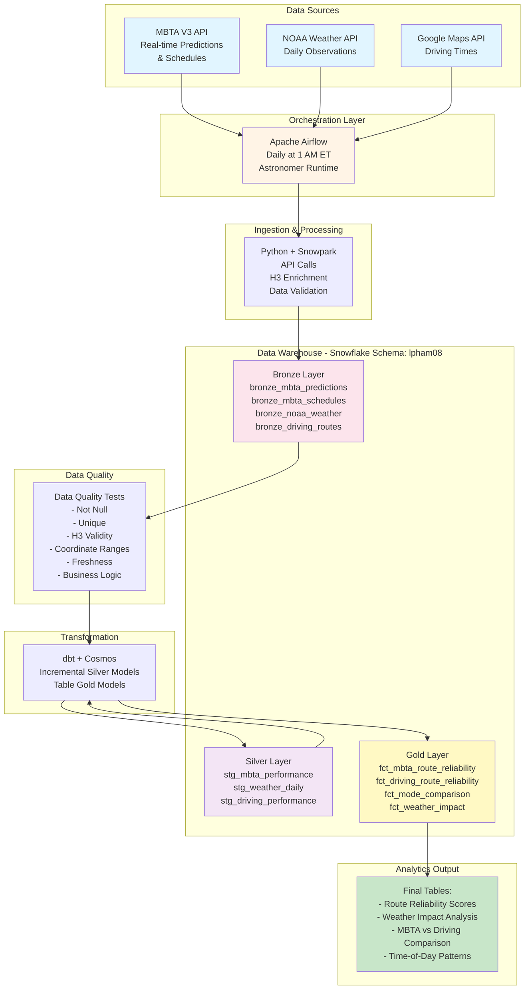
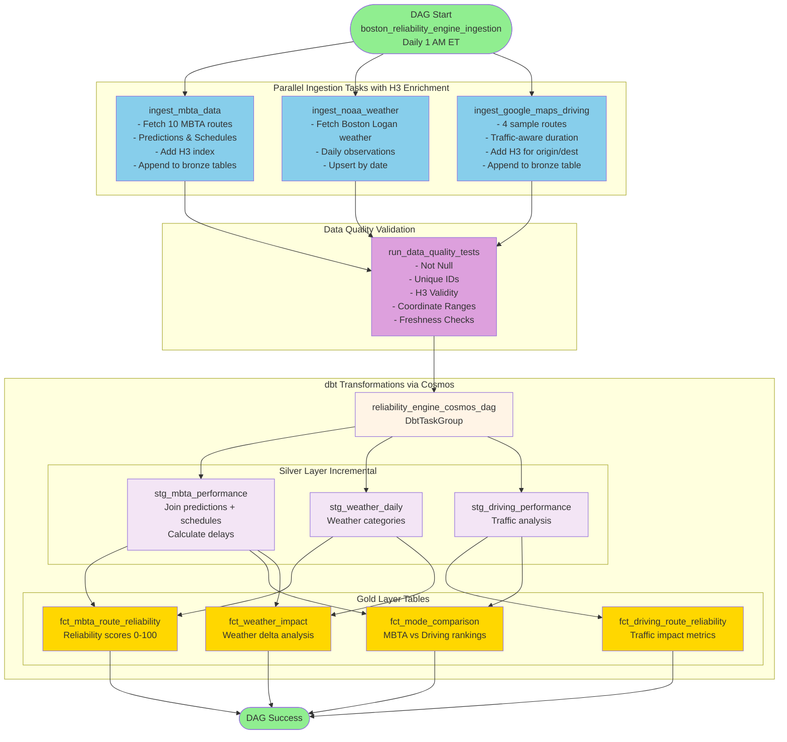
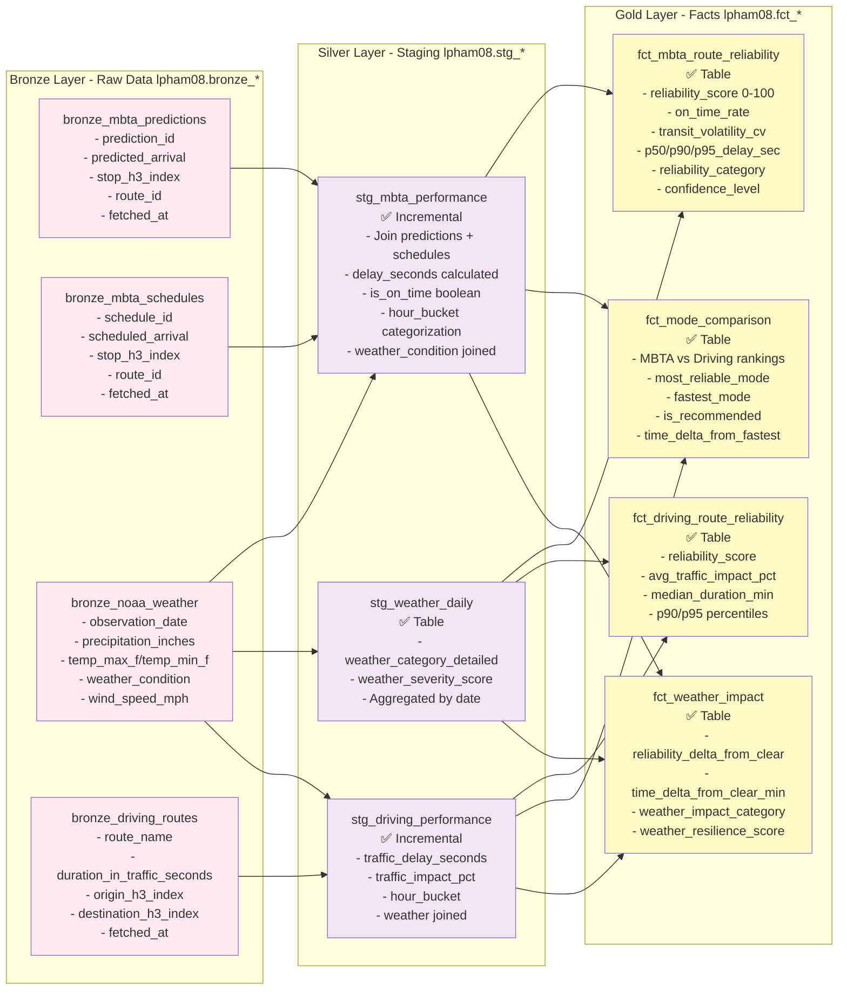
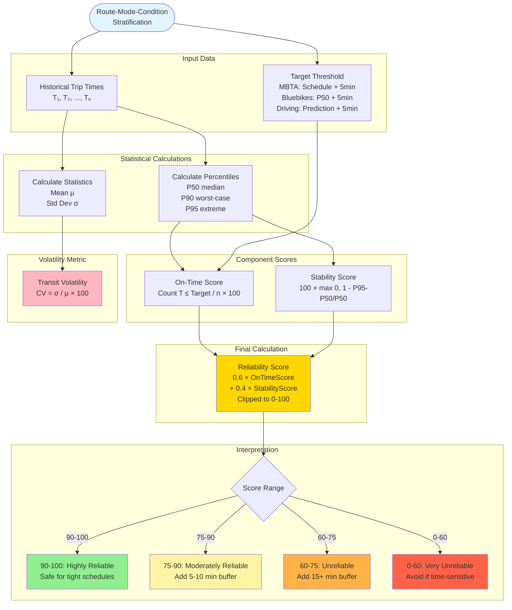
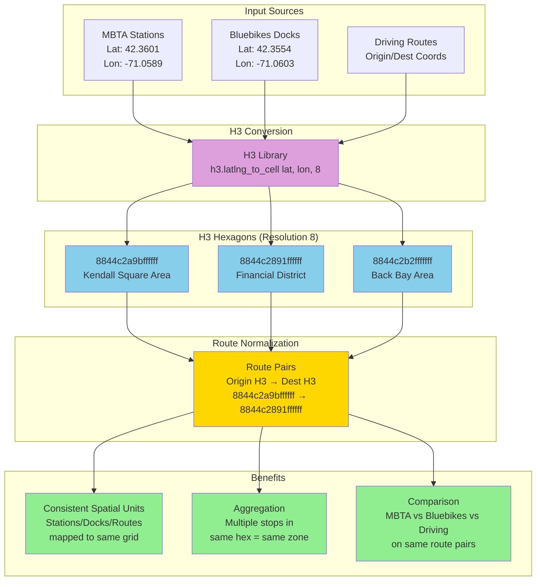
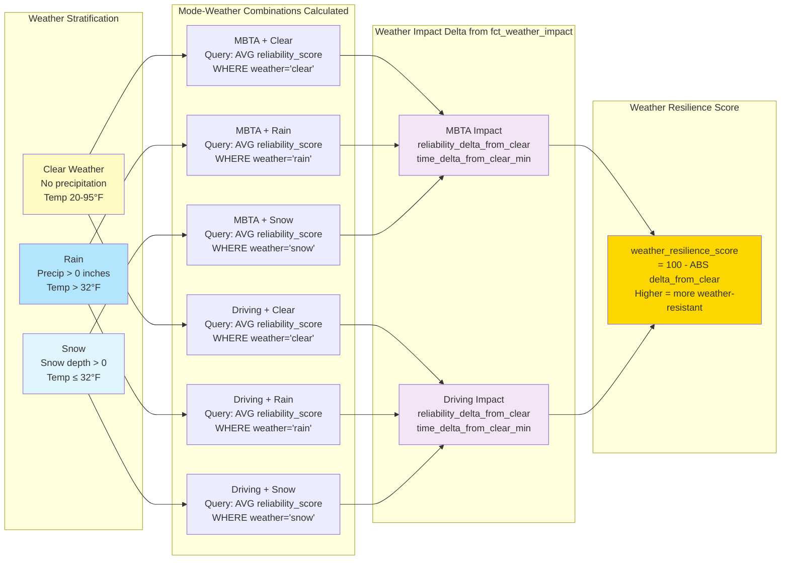
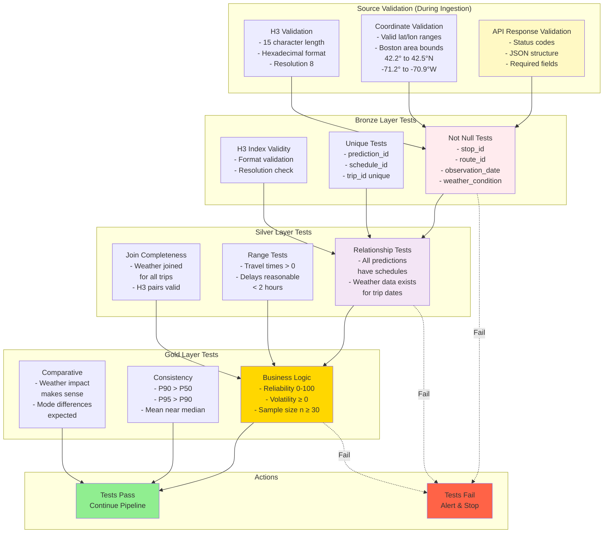

# Boston Reliability Engine - Architecture & Diagrams

## 1. High-Level System Architecture

## 2. Data Pipeline Workflow (Actual Airflow DAG)

## 3. Data Model - Bronze → Silver → Gold (Actual Implementation)

**Schema:** `lpham08` (all layers)

## 4. Reliability Score Calculation Flow

## 5. H3 Spatial Indexing Workflow

## 6. Weather Impact Analysis Flow

## 7. Data Quality Testing Framework

## 8. Implementation Status

### ✅ Phase 1: Bronze Layer - COMPLETE
- ✅ Astronomer Airflow environment set up
- ✅ Python + Snowpark ingestion scripts implemented
- ✅ Bronze tables created in Snowflake schema `lpham08`
  - `bronze_mbta_predictions`
  - `bronze_mbta_schedules`
  - `bronze_noaa_weather`
  - `bronze_driving_routes`
- ✅ H3 spatial indexing (resolution 8) implemented
- ✅ Historical data preservation (append mode)
- ✅ Data quality test framework implemented

### ✅ Phase 2: Silver Layer - COMPLETE
- ✅ dbt staging models created with Cosmos integration
- ✅ `stg_mbta_performance` - predictions + schedules joined, delays calculated
- ✅ `stg_weather_daily` - weather categories and severity scoring
- ✅ `stg_driving_performance` - traffic analysis and impact metrics
- ✅ Incremental materialization for efficiency
- ✅ Weather correlation logic
- ✅ Time bucketing (AM_PEAK, PM_PEAK, MIDDAY, OFF_PEAK)

### ✅ Phase 3: Gold Layer - COMPLETE
- ✅ Reliability score formula implemented (0.6 × on-time + 0.4 × stability)
- ✅ `fct_mbta_route_reliability` - reliability scores, volatility, percentiles
- ✅ `fct_driving_route_reliability` - traffic impact, reliability scores
- ✅ `fct_mode_comparison` - MBTA vs Driving with recommendations
- ✅ `fct_weather_impact` - weather delta analysis and resilience scores
- ✅ Transit volatility (coefficient of variation) metrics
- ✅ Confidence levels based on sample size

### ✅ Phase 4: Testing & Validation - IN PROGRESS
- ✅ Comprehensive dbt data quality tests in YAML
- ✅ Data quality tests in Python (not_null, unique, H3 validity, coordinate ranges, freshness)
- 🔄 Running daily to backfill historical data
- 🔄 Validating results with example queries
- ⏭️ Performance optimization (future)

### ✅ Phase 5: Documentation - COMPLETE
- ✅ Architecture diagrams (this file)
- ✅ Implementation summary (`IMPLEMENTATION_SUMMARY.md`)
- ✅ Testing guide (`TESTING_GUIDE.md`)
- ✅ Example queries (`EXAMPLE_QUERIES.sql`)
- ✅ dbt model README
- ⏭️ Production deployment (future)

## 9. Current Data Sources (Implemented)

| Data Source | API/Source | Update Frequency | Records per Day |
|-------------|-----------|------------------|-----------------|
| MBTA Predictions | MBTA V3 API | Daily | ~50K-100K |
| MBTA Schedules | MBTA V3 API | Daily | ~50K-100K |
| NOAA Weather | NOAA CDO API | Daily | 1 |
| Google Maps Driving | Google Maps API | Daily | ~100-200 |

**10 MBTA Routes:** Red, Orange, Blue, Green-B, Green-C, Green-D, Green-E, Mattapan, Silver Line SL1, Silver Line SL2

**4 Driving Routes:** Kendall→Financial District, Back Bay→Seaport, Harvard→Downtown, Allston→Kendall

## 10. Next Steps

1. **Production Deployment** - Deploy to Astronomer Cloud or production Airflow
2. **Increase Frequency** - Optionally change from daily to hourly/5-min ingestion
3. **Add More Routes** - Expand origin-destination pairs for driving analysis
4. **Dashboard Layer** - Connect Tableau/Looker to gold tables
5. **Alerting** - Set up alerts for data quality failures
6. **Bluebikes Integration** - Add bike-sharing data (future enhancement)